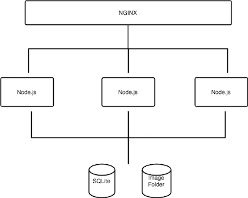

Virtual Zoo
===========

In this tutorial, we'll enable an application for OpenTracing and use the
tracing data to guide us in making several optimizations. The application we're
going to work with is a virtual zoo. Users can admit new animals into the zoo
by filling out a form and submitting a profile picture. 

Our application keeps track of its members with a database and renders a splash
page with thumbnail pictures of all the animals organized into a table.

The application uses NGINX to load-balance between multiple Node.js backends
and serve static content. When processing a new admittance, a Node.js server
writes the profile data to a shared sqlite database and resizes the profile
picture to a common thumbnail size. Architecturally, it looks something like this:

Enabling OpenTracing for NGINX
------------------------------

Enabling OpenTracing for Backends
---------------------------------

Performance Improvements
------------------------
