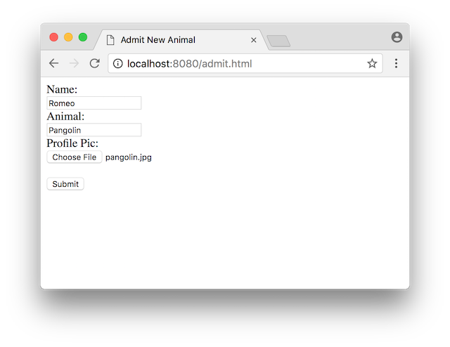
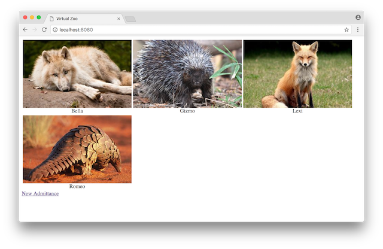
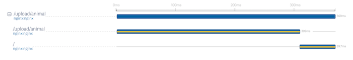
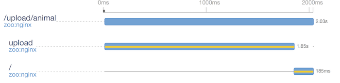
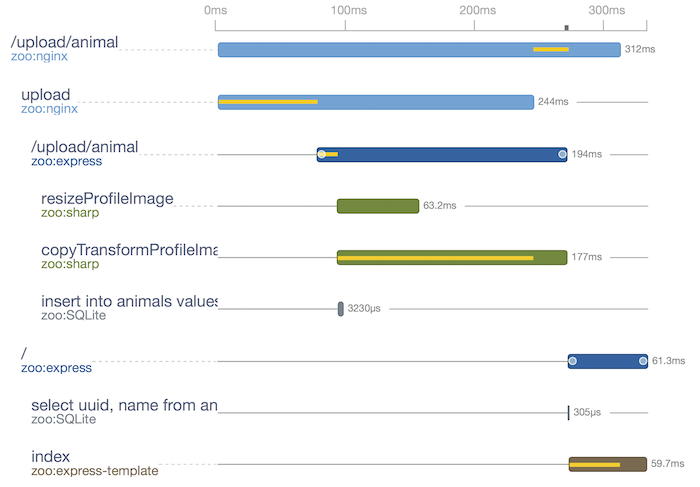
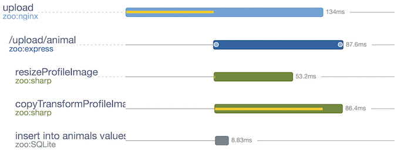
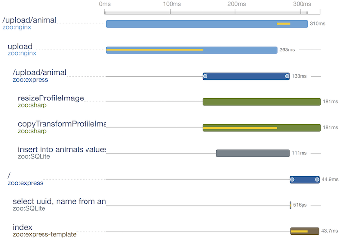

Virtual Zoo
===========

In this tutorial, we'll enable an application for OpenTracing and use the
trace data to guide us in making several optimizations. The application we're
going to work with is a virtual zoo. Users admit new animals into the zoo by
filling out a form and submitting a profile picture. 



Our application keeps track of its members with a database and renders a splash
page with thumbnail pictures of all the animals organized into a table.



The application uses NGINX to load-balance between multiple Node.js backends
and serve static content. When processing a new admittance, a Node.js server
writes the profile data to a shared sqlite database and resizes the profile
picture to a common thumbnail size. Here's what the NGINX configuration looks 
like:

```
events {}

http {
  upstream backend {
    server node-server1:3000;
    server node-server2:3000;
    server node-server3:3000;
  }

  server {
    listen 8080;
    server_name localhost;

    # Displays the zoo's splash page.
    location = / {
      # Don't pass the body so that we can handle internal redirects
      # from `/upload/animal`
      proxy_set_body             off;

      # The backend returns a table of thumbnail profile pictures for every
      # animal in the zoo.
      proxy_pass http://backend;
    }

    # Display the profile for a specific animal in the zoo.
    location = /animal {
      proxy_pass http://backend;
    }

    # Admit a new animal.
    location = /upload/animal {
      limit_except POST { deny all; }

      # The backend will add the new animal into the database, create a new
      # thumbnail sized profile picture, and transform the full-sized profile
      # picture, if necessary, to be in the jpeg format.
      proxy_pass http://backend;
      
      # Redirect to the spash page if the animal was successfully admitted.
      proxy_intercept_errors on;
      error_page 301 302 303 =200 /;
    }

    location / {
      root www; 
    }

    location ~ \.jpg$ {
      # Set the root directory to where the Node.js backend uploads profile 
      # images.
      include image_params;
    }
  }
}
```

Enabling OpenTracing for NGINX
------------------------------

We can tell NGINX to trace every request by adding these two lines to
`nginx.conf`:
```
http {
  lightstep_access_token `your-access-token`;
  opentracing on;
...
```
Now, we'll see the following when admitting a new animal into the zoo:



By default NGINX creates spans for both the request and the location blocks. It
uses the name of the first location as the name for the top-level span. We can
change this behavior by using the directives `opentracing_operation_name` and
`opentracing_location_operation_name` to set the names of the request and
location block spans respectively. We can also use the directive
`lightstep_component_name` to set a group name for related traces. For
example, by adding 
```
http {
...
  lightstep_component_name zoo;
...
    location = /upload/animal {
      opentracing_location_operation_name upload;
    ...
```
The trace will change to



At this point, similar information can be obtained by adding a logging
directive to the NGINX configuration. Advantages for OpenTracing are that the
data is easily accessible and searchable without needing to log onto a machine,
but much greater value can be realized if we also enable the backend for
OpenTracing.

Enabling OpenTracing for the Backend
---------------------------------

When using express with Node.js, OpenTracing can be turn on 
by adding tracing middleware to the express app:
```JavaScript
const app = express();
app.use(tracingMiddleware.middleware({ tracer }));
...
```
If tracing is additionally manually added for the database and image
operations, we'll see the following when uploading:




Performance Improvements
------------------------

One source of inefficiency we can see from looking at the trace is the file upload
for an animal's profile picture. The image is packaged as a component of the request body
using the multipart/form-data format where it's sent by NGINX to a Node.js server which uses
[form middleware](https://www.npmjs.com/package/express-formidable) to extract the file
and write it to disk. As pointed out in this [article](https://coderwall.com/p/swgfvw/nginx-direct-file-upload-without-passing-them-through-backend), there is some unnecessary copying that can
be eliminated by having NGINX write the file to disk and pass the file's path instead
of its contents to the Node.js servers. Updating NGINX's configuration file to do this
```
    location = /upload/animal {
      ...
      client_body_temp_path      /tmp/;
      client_body_in_file_only   on;
      client_body_buffer_size    128K;
      client_max_body_size       1000M;

      proxy_pass_request_headers on;
      proxy_set_header           admit-profile-pic $request_body_file; 
      proxy_set_body             off;
      proxy_redirect             off;
      ...
```
the `upload` span now looks like



We can see the reduction in time between when express first receives the
request and the images are first processed. From the span, we can also see
that the image processing is what dominates the time for `upload`. If we change the
processing to be asynchronous, the `upload` span will finish quicker, allowing more
of the other operations to execute concurrently. This is what the traces looks
like after having made both of these changes:



The full source code can be viewed [here](../example/zoo).
